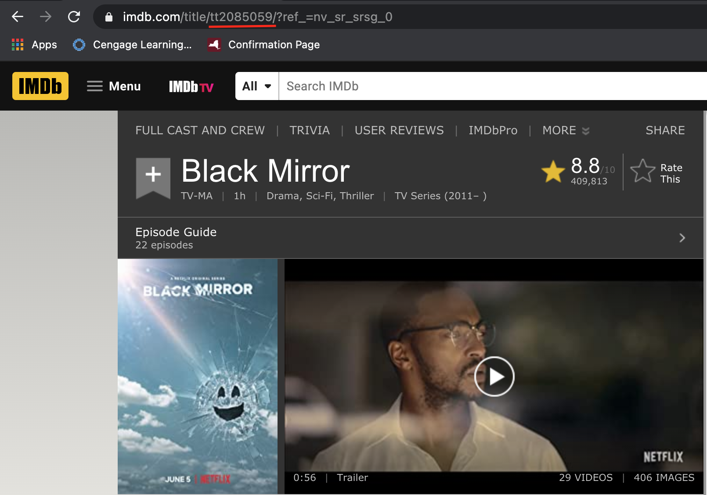

<br> <br>
```{r include=F}
library(stringr)
library(purrr)
library(collapsibleTree)
library(rvest)
library(htmlwidgets)
library(dplyr)
```





```{r, comment=NA}
# This is the title IMDb assigns to each film/TV Show
tt <- "tt2085059"
# I'm working on making this an app
yourl <- paste0("https://www.imdb.com/title/",tt,"/?ref_=tt_sims_tt")
# This extracts the titles of the shows that are similar to the one you searched.
show_tree_show <- yourl %>% 
  read_html() %>% 
  html_nodes(".rec-title b") %>% 
  html_text(trim=T)
# This extracts the tt from the shows saved in the previous step
show_morelike <- yourl %>% 
  read_html() %>% 
  html_nodes(".rec_item,.rec_selected") %>% 
  html_attr("data-tconst") 
# This makes a vector of all (12) of the URLs
yourls <- paste0("https://www.imdb.com/title/",show_morelike,"/")
# Since we are working with 12 URLs we need to use the map function to apply this function over a list. 
doThis <- function(i){
  show_tree <- read_html(i) %>% 
    html_nodes(".rec-title b") %>% 
    html_text(trim=T)
}
# This runs the function with each URL in the vector
shows_tree_like_chr <- unlist(map(yourls,doThis))
# This sets up the data how we need it by repeating each show title 12 times
show_tree_showlist <- NULL
for (i in 1:12){
  show_tree_showlist <- rep(show_tree_show,each=12)
}
# The name of the dataframe should be changed to reflect the show you are working with. 
Black_Mirror <- data.frame(
  show=show_tree_showlist,
  shows_like_shows=shows_tree_like_chr
)
# This builds the collapisble tree
collapsibleTree(Black_Mirror,c("show","shows_like_shows"))

```
